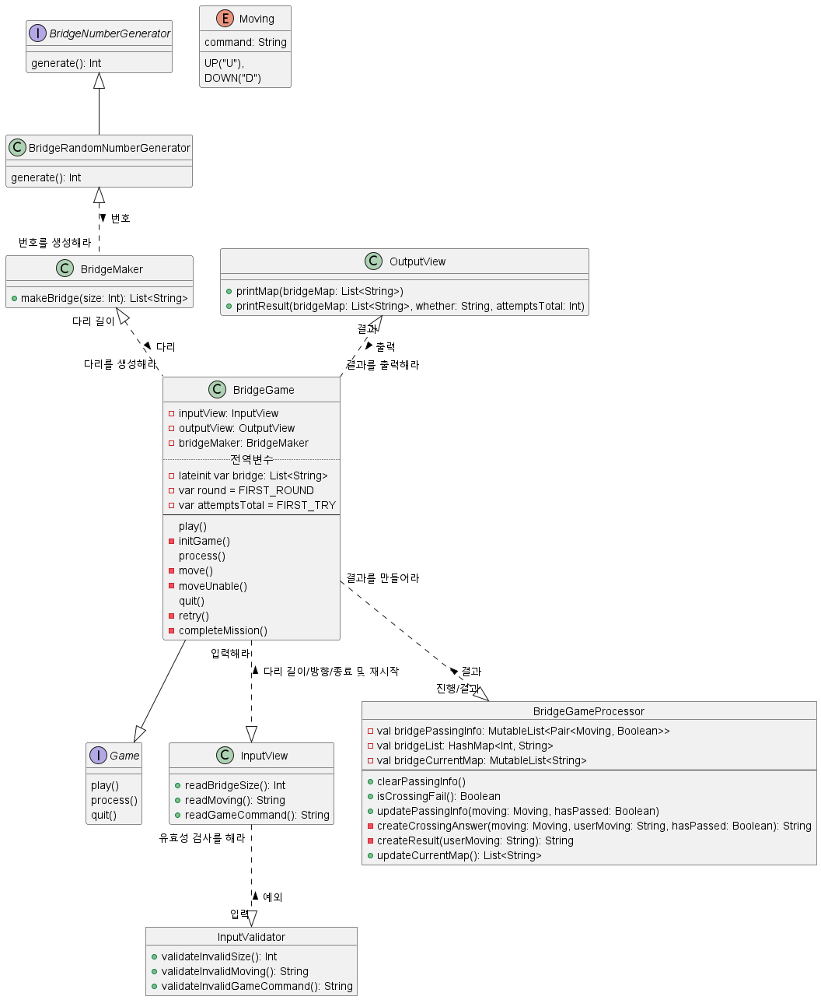

## 기능 목록

- 자동으로 생성할 다리 길이 입력 기능 
  - 3 이상 20 이하의 숫자를 입력할 수 있으며 올바른 값이 아니면 예외 처리
- 라운드마다 플레이어가 이동할 칸 입력 기능 
  - U(위 칸)와 D(아래 칸) 중 하나의 문자를 입력할 수 있으며 올바른 값이 아니면 예외 처리
- 게임 재시작/종료 여부를 입력 기능 
  - R(재시작)과 Q(종료) 중 하나의 문자를 입력할 수 있으며 올바른 값이 아니면 예외 처리
- 게임 시작 문구 출력 기능
- 게임 종료 문구 출력 기능
- 예외 상황 시 에러 문구를 출력 기능. 단, 에러 문구는 "[ERROR]"로 시작해야 한다.
